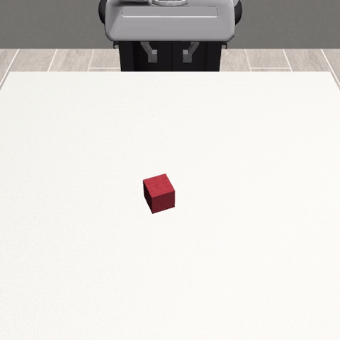
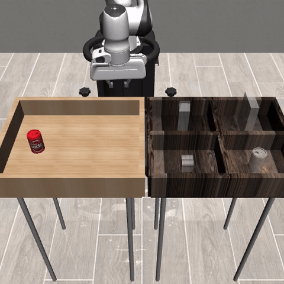

# Skoltech QuickSuccess — Pick & Place (RoboMimic + OAT)

Hackathon POC: **discrete action tokens (OAT)** for RoboMimic pick-and-place — **Lift** and **Can** tasks.

Paper baselines (frozen tokenizer + trained policy): **Lift 82%**, **Can 76.4%** success rate.

## Demo — successful rollouts (cluster POC, 2.5h fit)

Quick eval `n_test=10`, frozen HF tokenizer, policy trained from scratch on 200 demos.

### Lift — поднять куб

**SR: 80%** (8/10) · seed 10000 · ~epoch 274



### Can — поднять банку

**SR: 80%** (8/10) · seed 10000 · ~epoch 144



Checkpoints: `output/20260902/100353_train_oatpolicy_lift_N200/checkpoints/latest.ckpt`, `output/20260902/100352_train_oatpolicy_can_N200/checkpoints/latest.ckpt` (on cluster).

## Repo layout

```
docs/demo/               # success gifs for slides (committed)
oat/scripts/hackathon/   # pipeline scripts (copy into OAT tree or use from mipt_paper/oat)
```

Scripts expect the full [OAT](https://github.com/huggingface/oat) codebase at `oat/` root (RoboMimic env, policy training). This repo holds the **hackathon overlay** — scripts, manifest, cluster launchers, demo media.

## Quick start (cluster, 2 GPU)

```bash
# On ccmplanner (ccmplanner.mipt.ru), inside docker oat_mipt_robomimic_*:
cd /workspace/oat
bash scripts/hackathon/cluster_hackathon_poc.sh
# lift@GPU0 + can@GPU1, 2.5h train → eval n_test=10 → 1 success gif per task
```

From Mac — sync scripts and launch:

```bash
bash oat/scripts/hackathon/launch_on_cluster.sh
```

## Assets (Hugging Face — not in git)

| Asset | Hugging Face |
|-------|----------------|
| Tokenizers + policies | [hackhackhack66666/robomimic-oattok-policy](https://huggingface.co/hackhackhack66666/robomimic-oattok-policy) |
| Zarr datasets (200 demos) | [hackhackhack66666/robomimic_zarr](https://huggingface.co/datasets/hackhackhack66666/robomimic_zarr) |
| HDF5 for sim | [hackhackhack66666/aaai-datasets](https://huggingface.co/datasets/hackhackhack66666/aaai-datasets) |
| Eval summaries + demo videos | [hackhackhack66666/aaai27-models](https://huggingface.co/hackhackhack66666/aaai27-models) |

Download on cluster:

```bash
cd oat && bash scripts/hackathon/00_download_assets.sh
```

## Outputs (after POC run)

```
hackathon_output/
  logs/train_{lift,can}.log          # loss curves (tqdm)
  progress/{lift,can}_training_curve.png
  policies/poc/{lift,can}_latest.ckpt
  eval/timed/{lift,can}/eval_log.json
  gifs/{lift,can}_success_*.gif
```

## Tasks

| Task | Description | Paper SR | POC SR (n=10) |
|------|-------------|----------|---------------|
| **lift** | Pick cube | 82.0 ± 3.2% | **80%** |
| **can** | Pick can | 76.4 ± 3.0% | **80%** |

Manifest: `oat/scripts/hackathon/baseline_manifest.json`

## Docs

- Full pipeline details: `oat/scripts/hackathon/README.md`

## Status

- **Done:** cluster POC lift + can — 2.5h timed fit, frozen HF tokenizers, policy from scratch, eval + success gifs in `docs/demo/`
